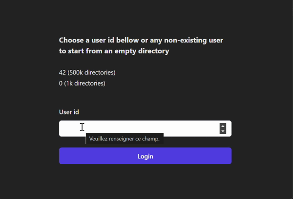

# Dabox

# Frontend

The frontend is a simple `react` app that uses the Dabox API to manage
directories. It (by default) use `localhost:3000` to reach the backend.



## Requirements

- deno 2 (2.1.0)

## Usage

To run the frontend, you first need to install the dependencies using
`deno install` and then you can run the `dev` script.

```
cd frontend
deno install
deno task dev
```

# Backend

The backend is a axum server that provides a REST API to manage directories and
basic authentication system that allow user isolation and can easily be extended
to support more complex authentication systems.

## Requirements

- Nightly rust toolchain (2024-11-01 was used for development)

## Usage and features

To run the backend, you can simply use the `cargo run` command from the
`backend` directory. The server will listen on port 3000 by default.

However there is few features that can be used to customize the behavior of the
server:

- The `default-dataset` feature will populate the repository with a default
  dataset that can be used to test the API. Example:
  `cargo run -F default-database`
  > Will populate the repository with a default dataset on the user with UID `0`
  > and `42`

- The `database` feature can be used to change the repository backend (eg: use a
  real database instead of an in-memory one).

  _Note_ Only placeholders is implemented for now the actual database backend is
  not implemented.

Once the server is running you can use the provided frontend to interact with
the API or use an HTTP client to interact with the API manually.

## API

### Authentication

The API use a simple header based authentication:

- `X-Entity-Id`: The unique identifier of the user making the request.

### Endpoints

- GET `/directory/:id`

  Return the directory with the given serial id and all its descendants.

  Example:

  ```
  GET /directory/1
  Headers:
    X-Entity-Id: 1
  ```

  Output:

  ```json
  {
    "sid": 1,
    "name": "root",
    "parent_sid": null,
    "children": [
      ...
    ]
  }
  ```

- POST `/directory`

  Create a new directory.

  Example (creating an orphan directory):
  ```
  POST /directory
  Headers:
    X-Entity-Id: 1
  Body:
    {
      "name": "New Directory",
    }
  ```

  Example (creating a directory inside another directory):

  ```
  POST /directory
  Headers:
    X-Entity-Id: 1
  Body:
    {
      "name": "New Directory",
      "parent": 1
    }
  ```

- PUT `/directory/:id`

  Update the name of the directory with the given serial id.

  Example:

  ```
  PUT /directory/1
  Headers:
    X-Entity-Id: 1
  Body:
    {
      "name": "New Name"
    }
  ```

- DELETE `/directory/:id`

  Delete the directory with the given serial id.

  Example:

  ```
  DELETE /directory/1
  Headers:
    X-Entity-Id: 1
  ```
